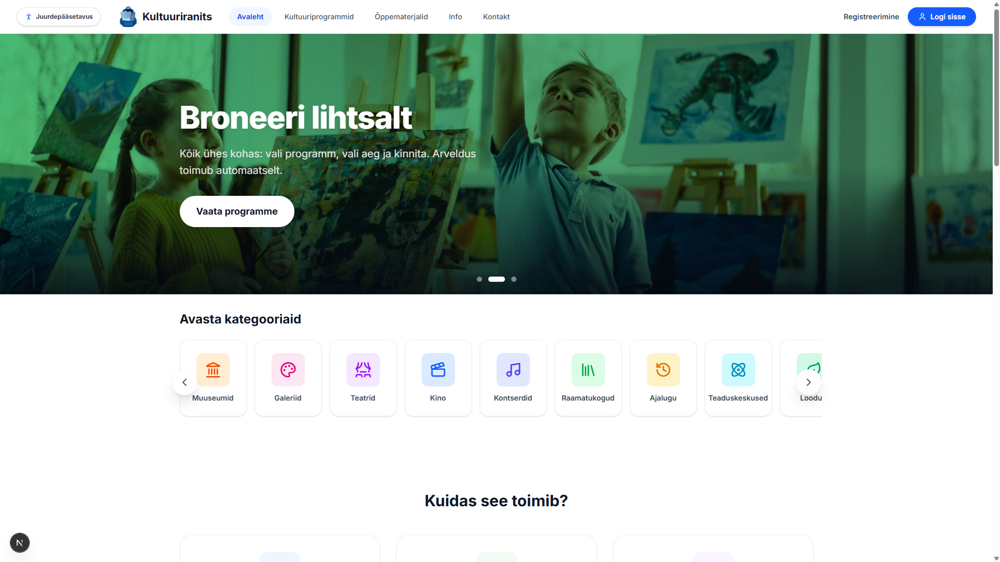

# Kultuuriranits



## Projekti kirjeldus

**Kultuuriranits** on veebirakendus, mille eesmärk on koondada Eesti kultuurihariduse programmid ühte kesksesse keskkonda. Rakendus aitab õpetajatel leida sobivaid kultuuriprogramme, õppematerjale ja õppekäike ning võimaldab kultuuriasutustel oma programme mugavalt hallata. Platvorm vähendab info killustatust, lihtsustab programmide otsimist ja filtreerimist ning toetab koolide ja kultuuriasutuste vahelist koostööd.

Projekt valmis **Tallinna Ülikooli Digitehnoloogiate instituudi** õppeaine **IFI6231.DT Tarkvaraarenduse projekt ehk suvepraktika** raames.

> **Märkus:** tegemist on Tallinna Ülikooli tarkvaraarenduse projekti raames loodud prototüübiga. Rakendus ei ole ametlik riiklik teenus ega lõplikult kasutusele võetud portaal.

---

## Töötav rakendus

Rakendus on kättesaadav aadressil:

```txt
https://jaltdorf.eu
```

---

## Põhifunktsionaalsus

Rakenduses on kolm peamist kasutajarolli: **õpetaja**, **kultuuriasutus** ja **administraator**.

### Õpetaja

Õpetaja saab:

- sirvida kultuuriprogramme;
- otsida ja filtreerida programme;
- vaadata programmi detailvaadet;
- lisada programme lemmikutesse;
- vaadata õppematerjale;
- anda programmidele tagasisidet;
- hallata enda lisatud tagasisidet.

### Kultuuriasutus

Kultuuriasutus saab:

- lisada uusi kultuuriprogramme;
- muuta enda programme;
- muuta programmi avalikustamise olekut;
- lisada programmidele kaanefotosid ja õppematerjale;
- vaadata enda programmidele jäetud tagasisidet;
- jälgida enda programmide statistikat;
- saada ja hallata teavitusi.

### Administraator

Administraator saab:

- vaadata süsteemi üldstatistikat;
- hallata kasutajaid;
- hallata programme;
- hallata õppematerjale;
- otsida, filtreerida ja sorteerida kasutajaid ning programme;
- saata välja meili teel masspostitusi;
- kustutada vajadusel sobimatut või aegunud sisu.

---

## Tehnoloogiad

### Frontend

Frontend asub kaustas:

```txt
kultuuriranits_frontend
```

Kasutatud tehnoloogiad:

| Tehnoloogia | Versioon |
|---|---:|
| Next.js | ^16.2.9 |
| React | 19.2.4 |
| React DOM | 19.2.4 |
| TypeScript | ^5 |
| Tailwind CSS | ^4 |
| Lucide React | ^1.17.0 |
| Recharts | ^3.8.1 |
| Embla Carousel React | ^8.6.0 |
| React Icons | ^5.6.0 |
| EmailJS Browser | ^4.4.1 |

### Backend

Backend asub kaustas:

```txt
kultuuriranits_backend
```

Kasutatud tehnoloogiad:

| Tehnoloogia | Versioon |
|---|---:|
| Java | 25 |
| Spring Boot | 4.0.6 |
| Spring Web MVC | 4.0.6 |
| Spring Security | 4.0.6 |
| Spring Data JPA | 4.0.6 |
| Spring JDBC | 4.0.6 |
| Spring Mail | 4.0.6 |
| Maven | wrapper |
| Lombok | — |
| MySQL Connector/J | runtime |
| H2 Database | runtime |
| Java Personal Code | 1.6 |

### Andmebaas

Projekt kasutab MySQL/MariaDB andmebaasi.

Vaikimisi kasutatav andmebaasi nimi:

```txt
kultuuriranits_db
```

---

## Projekti struktuur

```txt
Kultuuriranits-web-portal---group-7/
├── kultuuriranits_frontend/      # Next.js frontend
├── kultuuriranits_backend/       # Spring Boot backend
├── docs/                         # README pildid ja lisadokumendid
├── LICENSE                       # Litsents
└── README.md                     # Projekti ülevaade
```

---

## Paigaldusjuhend

### Eeldused

Enne projekti käivitamist veendu, et arvutis oleks olemas:

- Git
- Node.js
- npm
- Java 25
- Maven või projekti Maven Wrapper
- MySQL või MariaDB
---

### Soovituslikud programmid

Arenduskeskkonna ülesseadmiseks soovitame kasutada järgmisi programme (aga saab ka ilma, paigaldusjuhend on tehtud ilma programmideta):

- **IntelliJ IDEA** – backendi ehk Spring Boot rakenduse arendamiseks ja käivitamiseks;
- **Visual Studio Code** – frontendi ehk Next.js rakenduse arendamiseks;
- **MySQL Workbench** või muu MySQL/MariaDB haldusvahend – andmebaasi loomiseks ja haldamiseks;
- **Postman** – API endpointide testimiseks.
---

## 1. Projekti kloonimine

```bash
git clone https://github.com/TLU-DTI/Kultuuriranits-web-portal---group-7.git
cd Kultuuriranits-web-portal---group-7
```

---

## 2. Andmebaasi loomine

Loo MySQL/MariaDB andmebaas:

```sql
CREATE DATABASE IF NOT EXISTS kultuuriranits_db
  CHARACTER SET utf8mb4
  COLLATE utf8mb4_unicode_ci;
```

## 3. Backendi käivitamine

Liigu backend kausta:

```bash
cd kultuuriranits_backend
```

Ava konfiguratsioonifail:

```txt
src/main/resources/application.properties
```

Seadista andmebaasi ühendus vastavalt enda lokaalsele keskkonnale:

```properties
spring.datasource.url=jdbc:mysql://localhost:3306/kultuuriranits_db?createDatabaseIfNotExist=true&allowPublicKeyRetrieval=true&useSSL=false&serverTimezone=UTC
spring.datasource.username=kultuuriranits_user
spring.datasource.password=sinu_parool

spring.jpa.hibernate.ddl-auto=update
spring.jpa.show-sql=true

server.port=5050
```

Käivita backend:

```bash
./mvnw spring-boot:run
```

Windowsis:

```bash
mvnw.cmd spring-boot:run
```

Backend töötab vaikimisi aadressil:

```txt
http://localhost:5050
```

---

## 4. Frontendi käivitamine

Ava uus terminal ja liigu frontendi kausta:

```bash
cd kultuuriranits_frontend
```

Paigalda sõltuvused:

```bash
npm install
```

Loo frontendi kausta fail:

```txt
.env.local
```

Lisa sinna backendi aadress:

```env
NEXT_PUBLIC_BACK_URL=http://localhost:5050
```

Käivita arendusserver:

```bash
npm run dev
```

Frontend töötab vaikimisi aadressil:

```txt
http://localhost:3000
```

---

## 5. Rakenduse kasutamine lokaalselt

Kui backend ja frontend töötavad, ava brauseris:

```txt
http://localhost:3000
```

Rakenduse täielikuks testimiseks on vaja andmebaasis kasutajaid, rolle, organisatsioone, kategooriaid ja programme. Tabelid loob Spring Boot JPA seadistuse põhjal automaatselt, kui `spring.jpa.hibernate.ddl-auto=update` on aktiivne.

---

## Näidisandmed

### Kategooriad

```sql
INSERT INTO category (id, name) VALUES
  (1, 'Muuseumid'),
  (2, 'Galeriid'),
  (3, 'Teatrid'),
  (4, 'Kino'),
  (5, 'Kontserdid'),
  (6, 'Raamatukogud'),
  (7, 'Ajalugu'),
  (8, 'Teaduskeskused'),
  (9, 'Loodus'),
  (10, 'Töötoad')
ON DUPLICATE KEY UPDATE
  name = VALUES(name);

ALTER TABLE category AUTO_INCREMENT = 11;
```

### Organisatsiooni näide

```sql
INSERT INTO organization (
  name,
  address,
  city,
  state,
  type,
  phone,
  email
) VALUES (
  'Jüri Kool',
  'Laste 3',
  'Jüri',
  'Harjumaa',
  'kooliasutus', //'kultuuriasutus'
  '1234 5678',
  'email@email.ee'
);
```

---

## Keskkonnamuutujad

Frontend kasutab järgmist keskkonnamuutujat:

```env
NEXT_PUBLIC_BACK_URL=http://localhost:5050
```

Backendis on soovitatav päris paroolid ja muud tundlikud väärtused hoida lokaalselt või keskkonnamuutujates, mitte avalikus repos.

Näide:

```properties
spring.datasource.username=${DB_USERNAME}
spring.datasource.password=${DB_PASSWORD}
spring.mail.username=${MAIL_USERNAME}
spring.mail.password=${MAIL_PASSWORD}
```

---

## Autorid

Projekti autorid:

- Raimond Lige
- Janari Altdorf
- Lisette Reins
- Kevin Lillemets
- Karel Reose

---

## Litsents

Projektis on kasutusel [CC0 1.0 Universal](./LICENSE) litsents.

## Staatus

Projekt valmis Tallinna Ülikooli suvepraktika raames prototüübina. Rakendus demonstreerib Kultuuriranitsa portaali võimalikku toimimist ning vajab päriskasutusse võtmiseks täiendavat arendust, turvaülevaatust, testimist ja sisulist kooskõlastamist enne võimalikku päriskasutust.
